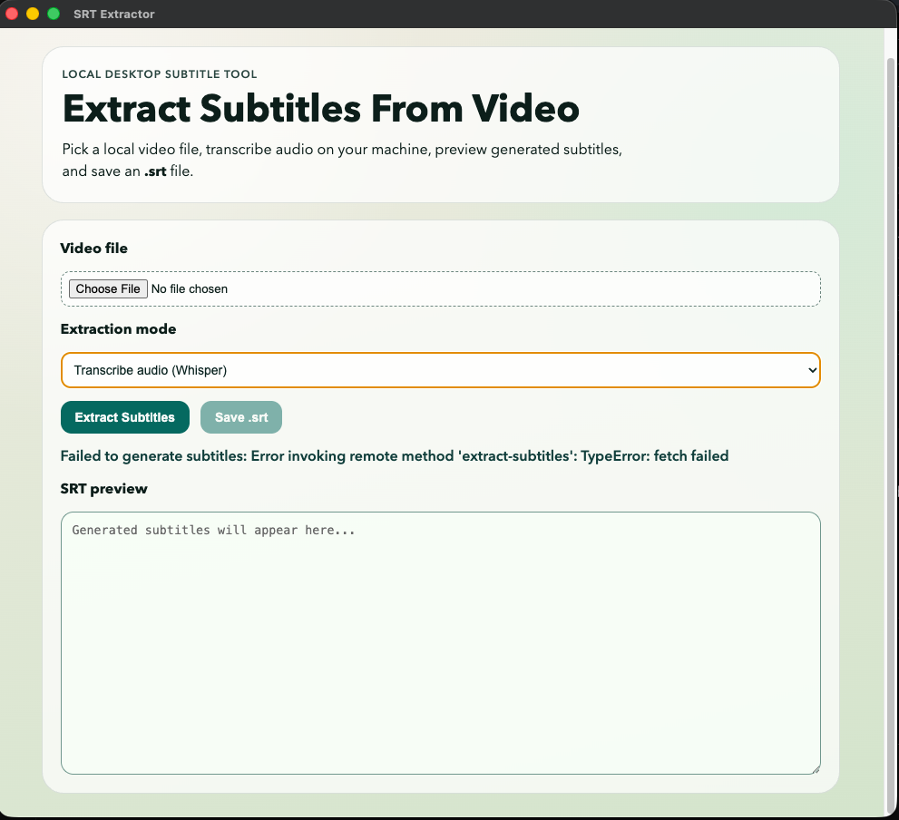

# SRT Extractor

Turn spoken video into clean subtitle files in minutes.

SRT Extractor is a local-first Electron desktop app that helps you generate `.srt` subtitles from video files using either speech transcription or embedded subtitle stream extraction.




## Why this project

- Private by default: your media stays on your machine.
- Two extraction paths: transcribe audio or pull existing subtitle tracks.
- Practical workflow: preview subtitle output, then save with native dialogs.
- Cross-platform packaging for macOS and Windows.

## Core features

- Local video upload (`video/*`)
- Audio extraction via bundled `ffmpeg-static`
- Speech-to-text via Whisper with `@xenova/transformers`
- Embedded subtitle stream extraction from supported containers
- In-app subtitle preview before export
- Save output as `.srt`

## Quick start

```bash
npm install
npm start
```

## Build installers

```bash
# macOS (.dmg + .zip)
npm run dist:mac

# Windows (.exe NSIS)
npm run dist:win

# Default builder targets
npm run dist

# Explicit macOS + Windows
npm run dist:all
```

Artifacts are generated in the `release/` directory.

## How to use

1. Open the app and select a video file.
2. Pick one mode:
   - **Transcribe audio (Whisper)** for speech-to-text generation.
   - **Extract embedded subtitle track** for subtitle streams already in the file.
3. If embedded mode is selected, choose a subtitle track.
4. Click **Extract Subtitles**.
5. Review the output and click **Save .srt**.

## Notes and limitations

- The first transcription can take longer while model assets are downloaded and cached.
- Transcription quality and speed depend on hardware and selected model.
- Image-based subtitle codecs may not convert cleanly to text `.srt` output.
- If Electron runtime download fails on first run:

```bash
npx install-electron
```

- Building a Windows installer on macOS may require Wine for full NSIS support.

## Open source

Contributions, issues, and feature requests are welcome.

If you are opening a pull request, include:

- What changed and why
- How you tested it
- Screenshots or logs for UI/packaging changes (if relevant)

## License

This project is licensed under the MIT License. See `LICENSE` for details.
# srt-extracter
